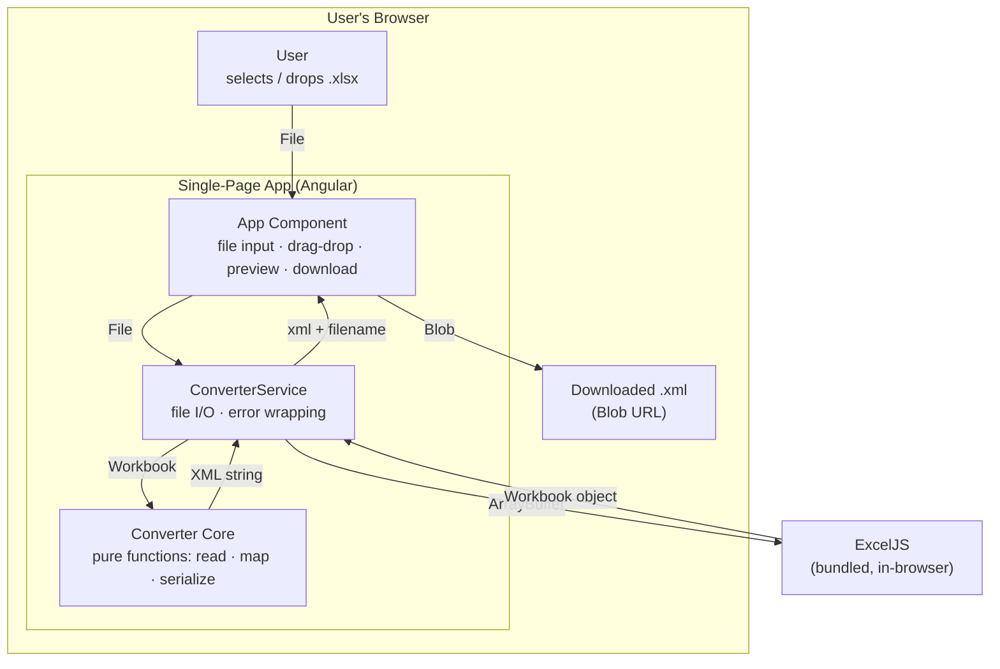
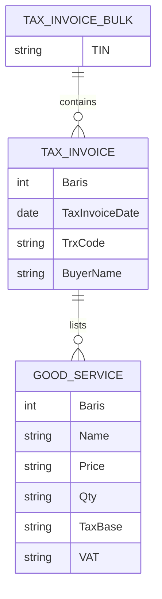

# Technical Architecture — XLSX → Coretax XML Converter

## Executive Summary

This is a browser-based tool that converts a completed DJP Coretax bulk tax-invoice
spreadsheet into the `TaxInvoiceBulk` XML file that Coretax accepts for bulk upload.
It exists to replace an ad-hoc Python script (`docs/script.py`) that tax operators
currently run from a terminal: the same conversion logic is re-implemented in
TypeScript so a non-technical user can drop an `.xlsx` onto a web page and get the
`.xml` back, with no install step. The two defining architectural choices are that
the conversion runs **entirely in the browser** — the spreadsheet never leaves the
user's machine — and that the output is held to **byte-for-byte parity** with a
known-good reference file (`docs/STT BPI 31082026-02092026.xml`), enforced by a
golden test. This document is written for developers and coding agents extending or
maintaining the converter.

## Goals & Constraints

### Functional Requirements

- The user can select or drag-and-drop a single `.xlsx` file and receive a
  downloadable `.xml` file whose name is the input name with the extension replaced
  (`STT BPI ....xlsx` → `STT BPI ....xml`).
- The XML output is identical, byte for byte, to what `docs/script.py` produces for
  the same input, using `docs/STT BPI 31082026-02092026.xml` as the reference
  contract.
- The tool reads the `Faktur` sheet (invoice headers, TIN) and the `DetailFaktur`
  sheet (line items), grouping line items to their parent invoice by the `Baris`
  key.
- Rows whose first cell (`Baris`) is empty are skipped without halting processing.
- An invoice with no matching line items still emits an empty
  `<ListOfGoodService></ListOfGoodService>`.
- A workbook with zero data rows is valid and produces the near-empty XML envelope;
  the UI notes "0 invoices".
- The UI shows the resulting filename, invoice count, byte size, a preview of the
  first lines of the XML, and a "Copy all" action.
- Conversion errors are surfaced to the user as plain-English messages.

### Non-Functional Requirements

- Conversion is client-side only; no network request carries file contents. [hard]
- Output encoding: UTF-8, no BOM, LF line endings, exactly one trailing newline.
- Conversion of a typical file (tens to low hundreds of invoices, ~40–200 kB
  workbook) completes in well under one second on a normal laptop. [target;
  no formal SLA]
- Output must be independent of the machine's timezone and locale.
- Production bundle stays within Angular's configured budgets, adjusted only as far
  as needed to accommodate the spreadsheet-parsing dependency.

### Constraints

- Language and runtime are fixed: TypeScript on Angular 21 (standalone components,
  signals), built with the `@angular/build` (esbuild) pipeline.
- Test runner is fixed: Vitest.
- Styling is fixed: Tailwind CSS v4.
- Spreadsheet parsing uses ExcelJS.
- `docs/script.py` is a reference for the field mapping only. Where the script and
  the reference XML disagree, `docs/STT BPI 31082026-02092026.xml` wins.
- No backend, database, or hosting service is in scope; the artifact is a static
  single-page app.
- User-facing strings are English only (the project carries no i18n setup).

## System Overview

The application is a single page that turns a file into a file, with all work done
in the browser tab.



The user hands a `File` to the App component, which passes it to `ConverterService`.
The service reads the file into an `ArrayBuffer`, loads it with ExcelJS into a
`Workbook` object, and calls the pure converter core, which walks the two sheets and
returns the finished XML as a single string. The service derives the output filename
and returns both to the component, which builds a `Blob`, shows a preview and
counts, and offers the download on an explicit button click. No step contacts a
server.

## Component Breakdown

### App Component

**Responsibility.** Owns the entire user interface and interaction state — file
selection, drag-and-drop, progress display, error display, XML preview, and the
download action.

**Interface.** Input: a `File` from an `<input type="file">` or a drop event.
Output: a rendered view and a browser download of `{ filename, xml }`. Internal
state is a signal modelling `idle | parsing | done | error`, plus signals holding
the last result (`xml`, `filename`, invoice count, byte size) and the last error
message.

**Why separate.** The UI is the only Angular-aware, DOM-aware unit. Keeping it thin
and free of conversion logic means the conversion can be tested without a browser
environment.

### ConverterService

**Responsibility.** Bridges the browser file world and the pure core: reads file
bytes, invokes ExcelJS, calls the core, derives the output filename, and translates
any failure into a typed `ConverterError`.

**Interface.** `convert(file: File): Promise<{ xml: string; filename: string }>`.
Rejects with a `ConverterError` carrying a `code` (see Error Handling Conventions)
and a user-facing `message`. Performs the pre-check that the file name ends in
`.xlsx` (or carries the OpenXML MIME type).

**Why separate.** It isolates all asynchronous and I/O concerns (`File.arrayBuffer`,
`Workbook.xlsx.load`) and all error-shaping in one place, so the core stays
synchronous and pure and the component stays declarative.

### Converter Core

**Responsibility.** The pure, framework-free port of `docs/script.py`: given a
loaded workbook, produce the exact XML string.

**Interface.** `convertWorkbook(wb: ExcelJS.Workbook): string`. Throws plain `Error`
with stable messages (e.g. missing sheet). No Angular imports, no DOM, no `fs`, no
timezone-sensitive calls. Supporting pure helpers live alongside it:

| Helper | Responsibility |
|--------|---------------|
| `cell(value)` | Convert one ExcelJS cell value to its output string (see Value Formatting Rules). |
| `escapeXml(text)` | Apply the three XML text-content escapes, `&` first. |
| `formatInvoiceDate(value)` | Produce `YYYY-MM-DD` from a date cell (UTC fields) or a string (first 10 characters). |

**Why separate.** This is the unit the golden test exercises directly, in the Node
test environment, with no browser and no Angular. Byte-for-byte parity is a property
of this module alone.

### Cross-Cutting Concerns

Error handling is centralised in `ConverterService`, which is the single place that
converts thrown errors into `ConverterError` values (the core throws generic errors;
the UI only ever reads `ConverterError.message`). There is no logging,
authentication, or persistence layer — the application has no server, no user
accounts, and stores nothing between sessions.

## Domain Model

The domain is the Coretax bulk tax-invoice document. The spreadsheet is a flattened,
two-sheet representation of the same tree the XML expresses directly.



**Relationships.** A `TaxInvoiceBulk` contains zero or more `TaxInvoice` entries —
one per data row of the `Faktur` sheet. Each `TaxInvoice` lists zero or more
`GoodService` entries — the `DetailFaktur` rows whose `Baris` value matches that
invoice's `Baris`. The `Baris` column is the join key between the two sheets; it is
a positional index within one file, not a stable identifier across files.

**Business Rules & Invariants.**

- The `TaxInvoiceBulk` carries exactly one `TIN`, read from a fixed cell
  (`Faktur!C1`), not from any data row.
- `Baris` groups line items to their invoice; multiple `DetailFaktur` rows share one
  `Baris` value and all attach to the single `Faktur` row with that value.
- A `TaxInvoice` with no matching `DetailFaktur` rows is still valid and still
  emitted, with an empty goods list.
- Every field of a `TaxInvoice` and `GoodService` is always written, even when the
  source cell is blank, producing an empty element such as `<AddInfo></AddInfo>`.
- Monetary amounts are carried through exactly as the spreadsheet holds them; the
  converter does not compute, round, or re-derive DPP, VAT, or totals.
- Several XML element names are misspellings fixed by the Coretax schema and must be
  emitted verbatim: `BuyerAdress` (one `d`), `CustomDoc`, `AddInfo`, `RefDesc`,
  `SellerIDTKU`, `BuyerTin`, `STLG` / `STLGRate`.

## Data Architecture

### Core Entities

These entities exist only in memory, for the duration of one conversion. There is no
database.

```
tax_invoice_bulk
  TIN (string)                     # from Faktur!C1
  invoices (list of tax_invoice)

tax_invoice                        # one Faktur data row (row 4+), 17 columns by position
  Baris (int)                      # join key, also the row filter
  TaxInvoiceDate (date → YYYY-MM-DD)
  TaxInvoiceOpt, TrxCode, AddInfo, CustomDoc, RefDesc, FacilityStamp (string)
  SellerIDTKU (string)
  BuyerTin, BuyerDocument, BuyerCountry, BuyerDocumentNumber (string)
  BuyerName, BuyerAdress, BuyerEmail, BuyerIDTKU (string)
  goods (list of good_service, FK → Baris)

good_service                       # one DetailFaktur data row (row 2+), 14 columns by position
  Baris (int, FK → tax_invoice.Baris)
  Opt, Code, Name, Unit (string)
  Price, Qty, TotalDiscount (string)
  TaxBase, OtherTaxBase, VATRate, VAT, STLGRate, STLG (string)
```

Column mapping is **positional**, matching `docs/script.py`: header rows (`Faktur`
row 3, `DetailFaktur` row 1) are read past, never validated. This survives the tax
authority re-wording header labels but breaks if columns are inserted or reordered —
an accepted trade-off documented under Known Limitations.

### Storage Technology Choices

There is no persistent storage, cache, or queue. The input file is read once into a
transient `ArrayBuffer`, parsed into an ExcelJS `Workbook` object that lives only on
the call stack, and the output XML is held as a string and a short-lived `Blob` URL
that the browser revokes after download. This is a deliberate choice: the data is
taxpayer information, and keeping it in volatile memory for the length of one
function call is the strongest privacy guarantee available to a web tool — nothing
to persist, nothing to leak, nothing to clean up.

### Data Flow

A conversion runs start to finish as: user provides a `File` → `ConverterService`
pre-checks the extension → `file.arrayBuffer()` → `new ExcelJS.Workbook().xlsx.load(buf)`
→ `convertWorkbook(wb)` looks up the `Faktur` and `DetailFaktur` sheets by name,
reads `TIN` from `Faktur!C1`, collects `Faktur` data rows (skipping empty-`Baris`
rows), indexes `DetailFaktur` rows into a map keyed by `Baris`, then assembles an
array of text lines — envelope, one `<TaxInvoice>` block per header row with its
grouped `<GoodService>` children — and joins them with `\n` plus a trailing newline
→ the service derives `filename` from `file.name` and returns `{ xml, filename }` →
the component renders counts and a preview and, on button click, saves a
`Blob([xml], { type: 'application/xml' })`. There are no asynchronous side effects
beyond reading the file.

## Key Architectural Decisions

| Decision | Choice | Rationale |
|----------|--------|-----------|
| Execution location | Fully client-side in the browser | Input is sensitive taxpayer data; a static SPA with no upload path means file contents cannot leave the machine. The existing repo is already a pure Angular SPA with no server. |
| Source of truth for output | The reference file `docs/STT BPI 31082026-02092026.xml` | It is the artifact Coretax has accepted. `script.py` is a guide to the field mapping, not the authority; a golden test pins the output to this file. |
| Serialization method | Hand-written string builder, not `XMLSerializer`/DOM | DOM serialization self-closes empty elements (`<AddInfo/>`), may reorder attributes, and gives no control over indentation or trailing newline — all of which would break byte parity. |
| Spreadsheet parser | ExcelJS | Reads from an `ArrayBuffer` in the browser, exposes typed cell values (distinct string vs. number, `Date` objects), MIT-licensed and available on the public npm registry. |
| Value formatting | Faithful port of `script.py`'s `cell()`, no special-casing | Matches the reference output exactly; monetary columns happen to be stored as text and pass through verbatim. Special-casing "money" columns was considered and rejected as unnecessary complexity that would diverge from the contract. |
| Date handling | Read `Date` via ExcelJS, format from **UTC** fields | ExcelJS builds date cells on a UTC epoch base, so the Excel wall-clock date lands in the `getUTC*` fields. Using UTC getters makes output independent of the runner's timezone; a naive `getMonth()`/`toISOString()` can shift the date by a day. |
| Component structure | UI directly in the root `App` component; router unused | Single-purpose tool; a second component and routing would be premature. Logic lives in a pure core module regardless, so the component staying small costs nothing. |
| ExcelJS import path | Explicit browser build (`exceljs/dist/exceljs.min.js`) | The package's default entry targets Node and pulls `stream`/`fs`-style deps that the esbuild builder cannot resolve. `allowedCommonJsDependencies` lists that path, and the production `initial` budget is raised to 1.5 MB warning / 2 MB error — ExcelJS is ~1.15 MB raw but ~275 kB over the wire, and the budget measures raw size. |
| Test fixture location | Read straight from `docs/` | The reference `.xlsx` and `.xml` already live there; duplicating them into a fixtures folder would create a second source of truth that could drift. |

## Security & Compliance

**Data protection.** The application performs no network I/O with file contents.
The spreadsheet is read into an in-memory `ArrayBuffer`, parsed, converted, and the
result offered as a download; nothing is uploaded, logged, or stored in
`localStorage`, `IndexedDB`, cookies, or any cache the application controls. The
generated `Blob` URL is created on demand and revoked after the download. Served
over HTTPS as a static asset, the app has no server component and therefore no
server-side data handling to secure.

**Authentication & authorization.** None. The tool is a stateless local utility with
no accounts, sessions, or protected resources.

**Secrets management.** None. The application has no API keys, tokens, or
credentials of any kind.

**Compliance.** The data being handled is Indonesian taxpayer invoice data. The
architecture's contribution to handling it responsibly is structural: because the
conversion is client-side and the app persists nothing, the tool does not become a
new place where taxpayer data is retained or transmitted. Any organisational
compliance obligations remain with the operator's own systems and are out of scope
for this tool.

## Error Handling Conventions

The pure core throws generic `Error`s with stable messages; `ConverterService` is
the single boundary that catches them and re-throws a typed `ConverterError`, and
the UI only ever reads `ConverterError.message`.

```typescript
export type ConverterErrorCode =
  | 'NOT_XLSX'
  | 'PARSE_FAILED'
  | 'SHEET_MISSING'
  | 'UNEXPECTED';

export class ConverterError extends Error {
  constructor(
    readonly code: ConverterErrorCode,
    message: string,
  ) {
    super(message);
    this.name = 'ConverterError';
  }
}
```

```typescript
// ConverterService.convert — the only place errors are typed
async convert(file: File): Promise<{ xml: string; filename: string }> {
  if (!/\.xlsx$/i.test(file.name) && file.type !== OOXML_MIME) {
    throw new ConverterError('NOT_XLSX', 'Please choose an .xlsx file.');
  }

  let wb: ExcelJS.Workbook;
  try {
    wb = new ExcelJS.Workbook();
    await wb.xlsx.load(await file.arrayBuffer());
  } catch {
    throw new ConverterError(
      'PARSE_FAILED',
      "Could not read this file as an Excel workbook. Make sure it's a valid .xlsx.",
    );
  }

  try {
    const xml = convertWorkbook(wb);
    return { xml, filename: file.name.replace(/\.[^.]+$/, '') + '.xml' };
  } catch (e) {
    if (e instanceof Error && e.message.startsWith('Sheet ')) {
      throw new ConverterError('SHEET_MISSING', e.message);
    }
    throw new ConverterError('UNEXPECTED', 'Something went wrong during conversion.');
  }
}
```

- The core never imports `ConverterError`; it throws plain `Error` with a message
  stable enough for the service to classify.
- Every rejection reaching the component is a `ConverterError` with a `code` and a
  ready-to-display `message`.
- Error messages are complete English sentences aimed at a non-technical operator;
  they never expose stack traces or library internals.
- Zero data rows is **not** an error — the converter returns the near-empty XML and
  the UI shows a "0 invoices" note.
- A missing `Faktur` or `DetailFaktur` sheet is reported with the sheet name in the
  message.

## Testing Expectations

The pure core is exhaustively tested; `ConverterService` and the component get light
coverage for wiring and error mapping only.

**What to test.**

- **Golden test (the contract):** load `docs/STT BPI 31082026-02092026.xlsx` with
  ExcelJS, run `convertWorkbook`, and assert strict `===` against the UTF-8 text of
  `docs/STT BPI 31082026-02092026.xml`. On mismatch, report the first differing line
  number and byte offset.
- **Timezone regression:** re-run the golden assertion with `process.env.TZ` set to
  `Asia/Jakarta` and to `America/New_York`; output must be identical.
- **`cell()` units:** `null` → `''`; integer number `12` → `'12'`; non-integer
  number `15990.99` → `'15990.99'` and `5.5` → `'5.50'`; string `'0.00'` →
  `'0.00'` verbatim.
- **`escapeXml()` units:** `&` becomes `&amp;` and is escaped before `<`/`>`; a
  literal `a & <b>` becomes `a &amp; &lt;b&gt;`; quotes are left untouched.
- **`formatInvoiceDate()` units:** a `Date` yields a zero-padded `YYYY-MM-DD`; a
  string yields its first 10 characters.
- **Synthetic workbooks** (built in memory with ExcelJS): a blank-`Baris` row in the
  middle of `DetailFaktur` is skipped, not treated as end-of-data; a `Faktur` row
  with no matching details emits `<ListOfGoodService></ListOfGoodService>`; a
  workbook missing the `Faktur` sheet makes `convertWorkbook` throw, and the service
  maps it to `ConverterError` with code `SHEET_MISSING`.

**Setup pattern.**

```typescript
// xlsx-to-xml.spec.ts — runs in the Node (not jsdom) Vitest environment
import { readFileSync } from 'node:fs';
import { fileURLToPath } from 'node:url';
import ExcelJS from 'exceljs';
import { convertWorkbook } from './xlsx-to-xml';

const docs = (name: string) =>
  fileURLToPath(new URL(`../../../docs/${name}`, import.meta.url));

test('golden: sample workbook converts byte-for-byte', async () => {
  const wb = new ExcelJS.Workbook();
  await wb.xlsx.load(readFileSync(docs('STT BPI 31082026-02092026.xlsx')));

  const actual = convertWorkbook(wb);
  const expected = readFileSync(docs('STT BPI 31082026-02092026.xml'), 'utf8');

  expect(actual).toBe(expected);
});
```

**File location.** Specs sit next to the source they cover
(`src/app/converter/xlsx-to-xml.spec.ts` beside `xlsx-to-xml.ts`). The core specs
declare the Node environment (via a `// @vitest-environment node` pragma or Vitest
config); component and service specs use the default jsdom environment.

**Coverage.** No hard percentage. The qualitative rule: the core converter and its
helpers must have direct unit tests for every branch, and the golden test must pass
before any change to the converter is merged. `ng build` must also succeed, since
the ExcelJS browser-build integration is a build-time concern the golden test cannot
catch.

## Appendix: Project Structure

```
src/
├── main.ts                     # Angular bootstrap (unchanged scaffold)
├── index.html
├── styles.css                  # Tailwind v4 entry
└── app/
    ├── app.ts                  # Root component — hosts the entire converter UI
    ├── app.html                # File input, drag-drop, preview, download, error/notice
    ├── app.css
    ├── app.config.ts           # Providers (router kept but unused)
    ├── app.routes.ts           # Empty route table
    ├── app.spec.ts             # Component wiring + error-message rendering
    └── converter/
        ├── xlsx-to-xml.ts      # Pure core: convertWorkbook() + cell(), escapeXml(),
        │                       #   formatInvoiceDate(); framework-free, no I/O
        ├── xlsx-to-xml.spec.ts # Golden test, TZ regression, helper units, synthetic
        │                       #   workbooks; runs in the Node test environment
        ├── converter.service.ts     # File → ArrayBuffer → ExcelJS → core; wraps
        │                            #   failures as ConverterError
        ├── converter.service.spec.ts
        ├── converter-error.ts       # ConverterError class + ConverterErrorCode union
        └── exceljs-dist.d.ts        # Type shim for the explicit browser-build import


docs/
├── script.py                          # Reference implementation (field mapping guide)
├── STT BPI 31082026-02092026.xlsx      # Golden test input
├── STT BPI 31082026-02092026.xml       # Golden test contract — the source of truth
└── technical-architecture.md           # This document
```

---

*This document should be reviewed and updated on any major architectural change.*
